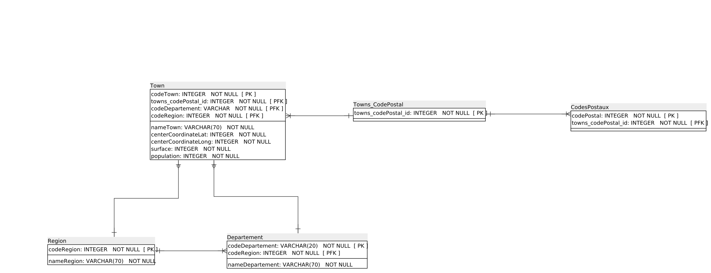

# searchTown App

## I - Introduction

### I-1 - Aim of the website
API de recherche des villes de France

### I-2 Requirements

#### Install Python and pip
sudo apt-get install python3-pip python3-dev libpq
sudo apt install python3-testresources

#### Dependance for spatialite
sudo apt-get install binutils libproj-dev gdal-bin
sudo apt-get install libsqlite3-mod-spatialite
sudo apt-get install gdal-bin

#### For deployment on serveur you could need this
sudo apt-get install nginx
sudo apt install gunicorn

##### Set enviroment variable
In nano ~/.bashrc add:
export SECRET_KEY='your secret key'
export DJANGO_SETTINGS_MODULE="searchTown.settings"
export NPM_BIN_PATH="/usr/local/bin/npm"

#### Install node
sudo apt update
sudo apt install nodejs
sudo apt install npm
sudo npm install -g n
sudo n stable
npm install nodemon

#### Install Tailwind for Django
See on readthedoc for[install django-tailwind](https://django-tailwind.readthedocs.io/en/latest/installation.html)

### I-3 - Get started

1. Clone the project to your machine ```[git clone https://github.com/sebajou/searchTown]```
2. Navigate into the directory ```[cd searchTown]```
3. Source the virtual environment ```[python3 -m env]```
4. Activate venv ```[source env/bin/activate]```
5. Install the dependencies ```[pip3 install -r requirements.txt]```

### I-5 - How to run

1. Run this command to start the backend server in the ```[searchTown]``` directory: ```[python manage.py runserver]``` (You have to run this command while you are sourced into the virtual environment)
2. Use your navigator to display the app. Generally : ```[http://127.0.0.1:8000/]```

### I-6 - Website architecture

## II - Database


*Database architecture*

## III - Backend

## IV - API

## V - Front
